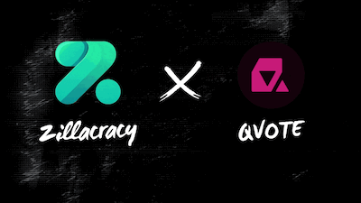

# Zilliqa QVote Web App :fire:
### [Join our discord!](https://discord.gg/AWt6k9XhpT)

Quadratic Voting dApp for Zilliqa

Part of the [Zillacracy grant initiative](https://medium.com/zillacracy/2021-here-we-come-january-2021-zillacracy-blog-55552a4bd556).



# Quadratic Voting - very oversimplified

Quadratic Voting is a better way of voting. It allows you to express more than simply your favourite choice. You are given a number of credits you can distribute to the options according to how you feel about them. You can also give negative credits to the options you don't like. The effective number of votes you cast for a given amount of credits is the square root of the absolute number of credits. This encourages you to vote for multiple options instead of piling all your credits on one choice. In this way you effectively get to rank the options according to your preference, and also express the extent to which you like or dislike an option.

# Uses
[ZilliqaQVoteContracts](https://github.com/QVote/ZilliqaQVoteContracts)
[ZilliqaQVoteSDK](https://github.com/QVote/ZilliqaQVoteSDK)

# Features
- Deployment of decisions with registration end time and vote end time
- Registration of voters by owner or by snapshot of token holders (this is works with an api endpoint)
- Quadratic Voting on decisions
- Results view
- Storage of recent decision addresses in cookies
- Storage of recent transactions in cookies
- Links to viewblock
- By design can integrate with other wallets
- By design can easilly be integrated into a different blockchain

# To run locally
```bash
npm run install
```

```bash
npm run dev
```
